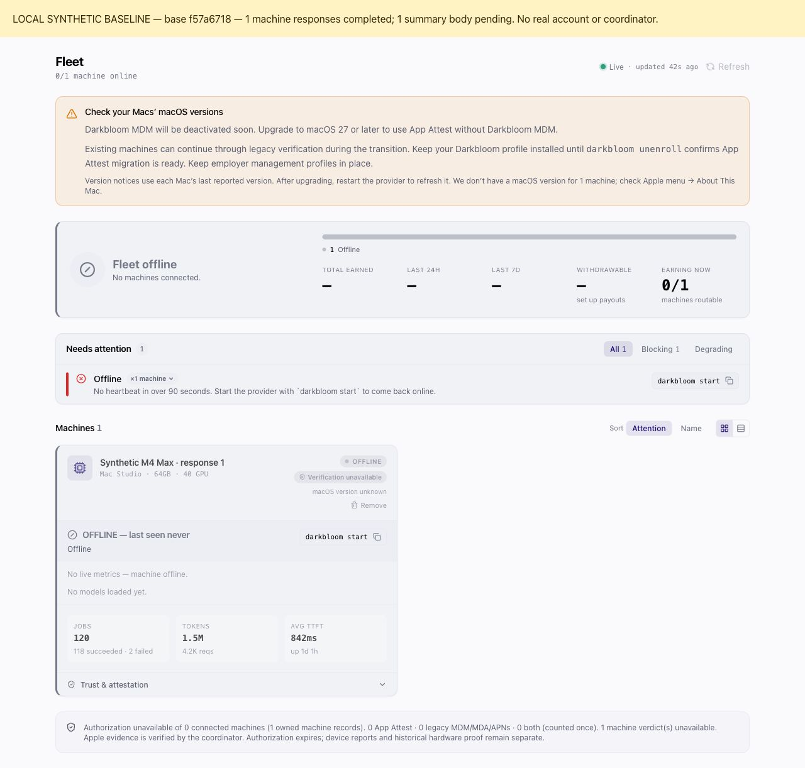
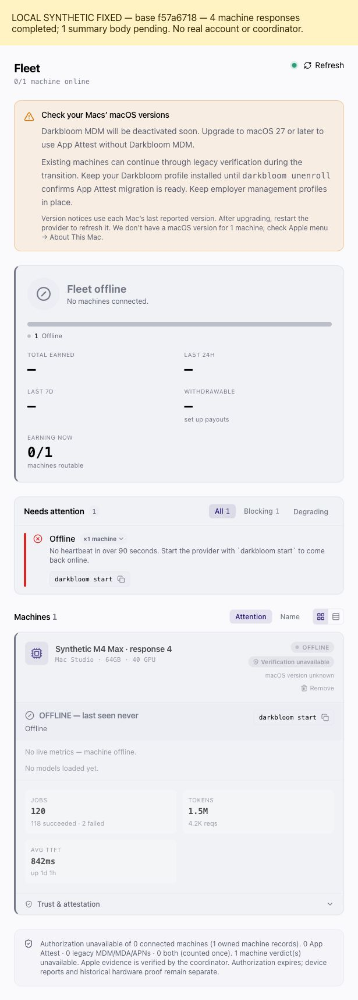

# Stalled earnings summary — synthetic browser evidence

Baseline: f57a671856bd7a9dd3646e0c77db6ef46751c854.
Fix: 9f8331280a9b59ec581b7547b0440f5a64529ce7.
Captured October 7, 2026 in the Codex in-app browser.

The loopback fixture imports the actual ProviderDashboard and useFleetData. The baseline substitutes the hook from the pinned original commit; the fixed variant loads the signed fix. Both return synthetic machine data while sending summary response headers and deliberately withholding the JSON body. Authentication and next/link are local shims. CSS comes from the passing Next.js 16.2.11 production build. Node 22.23.3; bounded two-job, 600-second fixture commands. No production or real account data is used.

The baseline image shows one machine response and disabled Refresh while the summary stays pending. The fixed image shows four machine responses and enabled Refresh while one summary stays pending. Captures use their normal browser viewports and are not a layout comparison. Separate later DOM evidence showed response5; the screenshot and DOM are not simultaneous. These images do not isolate manual versus scheduled refresh. The PR's actual native-fetch HTTP regressions independently isolate a real button click, exercise both stalled headers/body, and verify eventual summary display.

This proves the tested frontend request/render behavior. It does not qualify real authentication, Next route proxies, a live coordinator, or a particular reported production incident. The summary itself remains one bounded pending request until settlement or session cleanup.

## Original behavior

## Fixed behavior

## Image hashes

- browser-baseline.jpg: `9f428058b0be8bd3e9f8da72c2aa3791057e2431aa4564811d480593344ad95f`
- browser-fixed.jpg: `f7a36ffe2a99de2c84905e277484f784da93276ff1bce958eb5d3429d2c4e88c`
